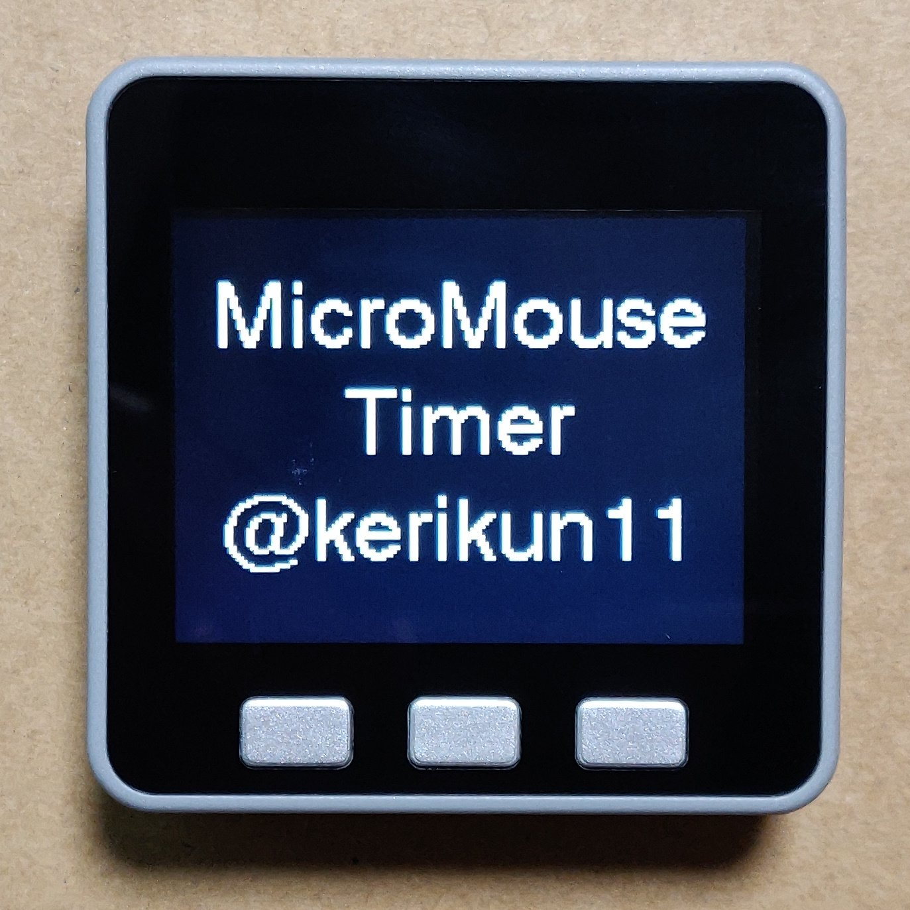

# M5Stack MicroMouse Timer

M5Stackで作ったマイクロマウス走行時間計測装置

---

## デモ動画

*百聞は一見にしかず*

動画の内容:

1. 制限時間の設定
2. 競技開始
3. スタート → ゴール
4. スタート → タッチ(リタイヤ)
5. 持ち時間の終了

---

## 機能

### 主な機能

- 制限時間の管理
    - 制限時間の設定(分単位)
    - 制限時間のカウントダウン(秒単位)
    - 制限時間経過時のサウンド
- 走行回数の管理
    - 走行回数の表示
    - 走行ごとにインクリメント
- 走行時間の管理
    - 走行時間の計測(ミリ秒単位)
    - 現在の走行時間の表示
    - 過去の走行時間のリスト表示
    - 最短走行時間のハイライト表示

### 表示内容

- 走行中のタイム
- 残りの持ち時間
- 現在の出走回数
- 各出走のタイム

### ボタンの役割

- 左側: スタートセンサの代わり
- 中央: ゴールセンサの代わり
- 右側: リセット/タッチ(リトライ)ボタン

### タイマーの精度

- M5Stack に使用されている水晶発振器はTCXO(温度補償水晶)なので高精度
- 精度は10ppmとのこと[(参考)](https://github.com/m5stack/M5-Schematic/blob/master/Core/Basic/M5-Core-Schematic(20171206).pdf)

---

## 開発

詳しくは[こちら](firmware)

---

## 今後の展望

- スタートセンサ・ゴールセンサとの連携
- WiFiやBLEなどを用いた情報取得APIの提供
